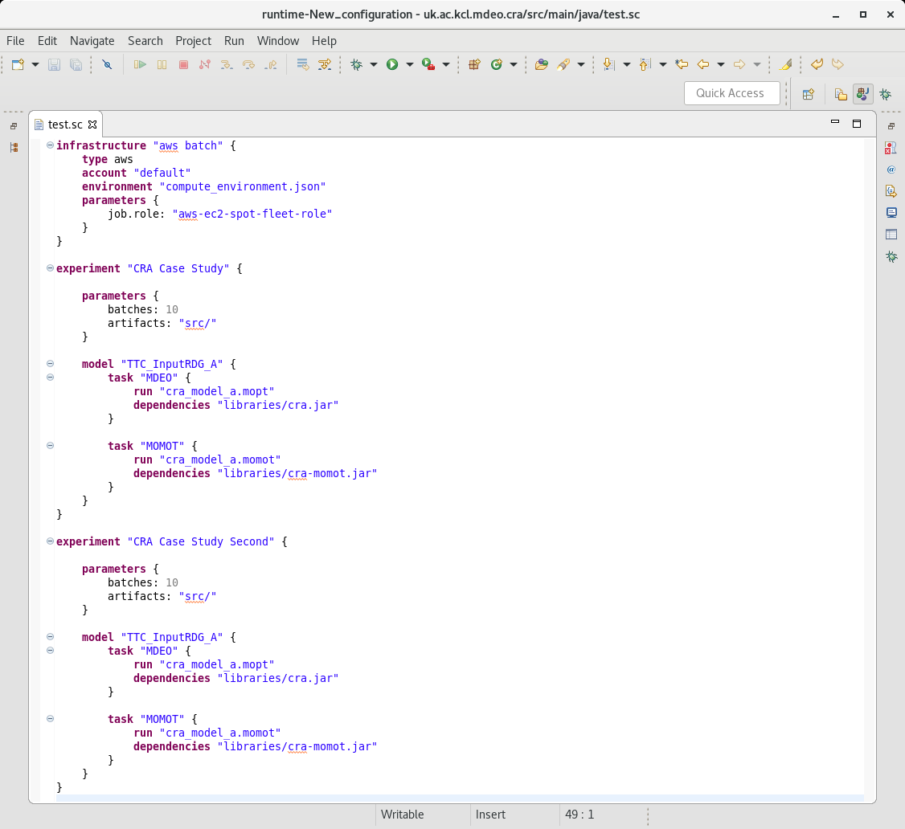
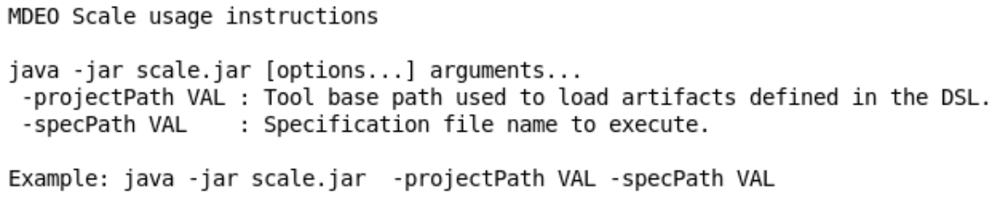

# MDEOptimiser Scale

This is an implementation for a DSL that makes it easy to run search-based model engineering experiment workflows using MDEOptimiser and MOMoT.

The initial version of this tool has been described in a research paper which can be downloaded [here](./readme/paper.pdf).

A presentation introducing the tool can be downloaded [here](./readme/mdeo-scale-presentation.pdf).

## Interfaces

Currently the tool can be executed as an Eclipse IDE plugin or using the command line.
The Eclipse IDE plugin offers a basic syntax highlighter for the language elements (as automatically generated by the XText framework).

To extend the tool for other SMBE tools, follow the current implementation already available for MDEO and MOMoT.

## Eclipse Plugin

The Eclipse plugin has been implemented using XText and offers an easy to use GUI to set up the MDEO Scale experiments.

An example of a configuration file specified using MDEO Scale has been included below.

## CLI Interface

MDEO Scale can also be executed as a command line tool. In fact, the Eclipse Plugin described above uses this functionality to execute the configuration files.

When executed from the command line the tool prints a set of help instructions.

The two required parameters are:

* -projectPath : The full path to which the artifacts specified in the configuration are relative to;
* -specPath : The full path of the specification file to execute in a given instance.

## How to run

1. Clone the repository
2. Build the maven project and install locally `mvn clean install`
3. At this point you can run the CLI version of the tool
4. Once the CLI build finished, run the Eclipse Plugin build inside interfaces/eclipse/ using `mvn package`
5. Open the Eclipse Plugin project in Eclipse and run the uk.ac.kcl.inf.mdeoptimiser.ui as an Eclipse Application.

Currently there is no CI build for this tool and no P2 update site is available for installation inside a standalone Eclipse distribution.

### Note about software versions:

The steps above have been tested using Java 11 and Eclipse 2019-03. Newer versions _should_ work.

## Prototype

Users should note that this tool is a prototype. 

## Note about cloud services

Don't instantiate (any)many servers and then forget about them.
